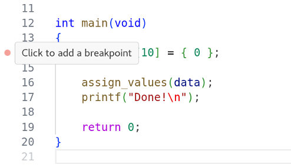
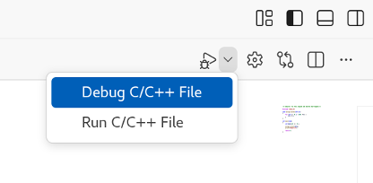

# Task 4: Debugging in VS Code

For this task, we will return to the crashing C program from Task 1 of
Session 1. We will try debugging this program in VS Code.

> [!NOTE]
> Make sure you've installed the C/C++ Extension Pack into VS Code before
> you begin this task!

1. Open `crash.c` in the VS Code editor. Hover the cursor over the left
   margin, to the left of the line numbers. You should see a pink dot appear,
   which tracks the movement of the cursor.

   

   Click on the dot when you are on line 14. It should become red and stay
   fixed to that line. This marks a breakpoint. Click on it again to remove
   it, then click once more to reestablish the breakpoint.

2. Choose *Debug C/C++ File* from the dropdown menu beside the Run/Debug
   button, at the top-right of the VS Code UI.

   

[vsc]: https://code.visualstudio.com/docs/cpp/cpp-debug
